# CYD Usage Meter

`ESP32-2432S028R` Cheap Yellow Display에서 Codex 또는 Claude Code 사용량을 보여주는 BLE 사용량 미터입니다.

바로 설치:

[https://sioaeko.github.io/clawdmeter-cyd/web-flasher/](https://sioaeko.github.io/clawdmeter-cyd/web-flasher/)

Chrome/Edge에서 CYD를 USB로 연결하고 **Install**을 누르면 됩니다. Web Serial은 HTTPS 또는 `localhost`에서만 동작합니다.



## 기능

- CYD `ESP32-2432S028R` 지원
- Portrait `240x320`, Landscape `320x240` 펌웨어 제공
- Codex / Claude Code 사용량 BLE 표시
- `Used` 사용량 기준과 `Left` 남은량 기준 전환
- 보드 Settings에서 Display, Theme, Accent, Bluetooth, Night Mode 설정
- Night Mode: 지정 시간 동안 화면을 완전히 끄고, 터치하면 임시 wake
- macOS Codex/Claude daemon installer
- Windows 수동 daemon 실행 지원
- GitHub Pages 기반 ESP Web Tools flasher

## 배포 정리

이 빌드는 단순 사용량 UI와 설정 UI만 유지하고, 제3자 마스코트/브랜드 로고/비공개 폰트 기반 자산을 제거한 clean 배포 방향입니다.

- 스플래시는 자체 추상 미터 애니메이션입니다.
- 펌웨어 폰트는 LVGL 내장 Montserrat를 사용합니다.
- BLE 장치명은 `CYD Usage Meter`입니다.
- Claude Code, Codex, Anthropic, OpenAI는 호환 대상 설명에만 사용됩니다. 이 프로젝트는 해당 회사들과 공식 제휴가 없습니다.

## Flash

웹 플래셔에서 원하는 방향을 고르면 됩니다.

- **Portrait**: 240x320 세로 화면
- **Landscape**: 320x240 가로 화면

CLI로 플래시하려면:

```bash
./flash-mac.sh cyd_2432s028r
./flash-mac.sh cyd_2432s028r_landscape
```

펌웨어를 다시 빌드한 뒤 웹 플래셔 바이너리를 갱신하려면:

```bash
./tools/update_web_flasher.sh
```

## Board Settings

Wi-Fi/AP 설정 포털은 사용하지 않습니다. 설정은 보드의 `Settings` 화면에 저장됩니다.

Settings는 두 페이지입니다. `NEXT`/`PREV`로 이동합니다.

Page 1:

- `Display`: `Used` 또는 `Left`
- `Theme`: `Dark` 또는 `Light`
- `Accent`: `Green` 또는 `Warm`
- `Bluetooth`: BLE 상태 화면 열기

Page 2:

- `Night`: Night Mode 켜기/끄기
- `Start`: 시작 시간을 1시간씩 이동
- `End`: 종료 시간을 1시간씩 이동

Night Mode는 desktop daemon이 BLE payload에 같이 보내는 `now` 값을 기준으로 동작합니다. 부팅 직후 첫 payload를 받기 전에는 스케줄이 적용되지 않습니다.

## Bluetooth

컴퓨터에서 아래 BLE 장치를 찾으면 됩니다.

```text
CYD Usage Meter
```

Windows와 Mac mini를 같이 쓰는 경우에는 보드를 **Mac mini에만 페어링**하고 Mac mini에서 daemon을 상시 실행하는 구성이 가장 안정적입니다. 사용량은 계정 기준이라 Windows에서 Codex를 써도 Mac mini daemon이 같은 계정으로 로그인되어 있으면 보드에 반영됩니다.

Codex daemon과 Claude Code daemon을 동시에 같은 보드에 붙이면 값이 서로 덮일 수 있습니다. 한 번에 하나만 켜는 구성을 권장합니다.

## macOS Daemon

Codex:

```bash
codex login
./install-codex-mac.sh
tail -F ~/Library/Logs/codex-usage-daemon.out.log
```

Claude Code:

```bash
./install-mac.sh
tail -F ~/Library/Logs/claude-usage-daemon.out.log
```

## Windows Daemon

Codex:

```powershell
codex login
py -3 -m venv daemon\.venv
.\daemon\.venv\Scripts\python.exe -m pip install bleak httpx
.\daemon\.venv\Scripts\python.exe .\daemon\codex_usage_daemon.py
```

Claude Code:

```powershell
py -3 -m venv daemon\.venv
.\daemon\.venv\Scripts\python.exe -m pip install bleak httpx
.\daemon\.venv\Scripts\python.exe .\daemon\claude_usage_daemon.py
```

## Development

CYD portrait build:

```bash
pio run -d firmware -e cyd_2432s028r
```

CYD landscape build:

```bash
pio run -d firmware -e cyd_2432s028r_landscape
```

Local web flasher:

```bash
python3 -m http.server 8787 --directory web-flasher
```

Open:

```text
http://localhost:8787/
```

## Hardware Notes

Default target is the common CYD board revision:

- TFT: MISO 12, MOSI 13, SCLK 14, CS 15, DC 2, BL 21
- Touch: IRQ 36, MISO 39, MOSI 32, CLK 25, CS 33
- Button: BOOT/GPIO0

If touch or colors are reversed, check:

```text
firmware/src/boards/cyd_2432s028r/board.h
```

## Upstream

This repository started as a CYD port of [HermannBjorgvin/Clawdmeter](https://github.com/HermannBjorgvin/Clawdmeter).
